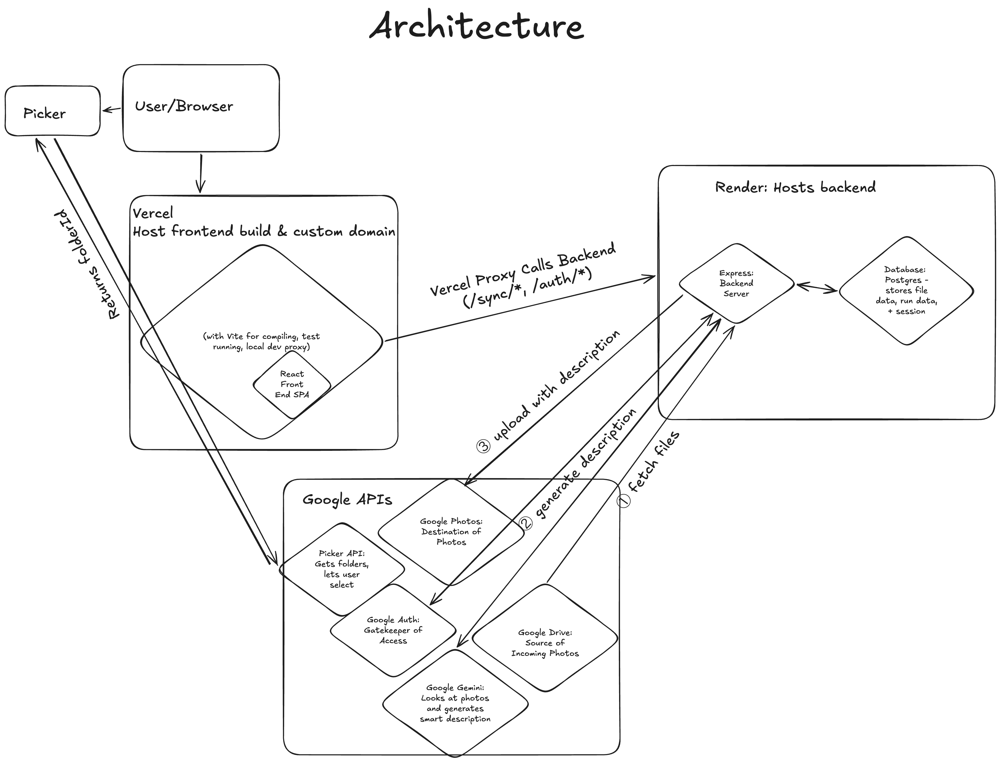

# drive-photos-sync

Why search through drive, hunting around for your old photos? This web app

- Uses AI (Google Gemini) to add labels to your Drive Photos to improve searching
- Then syncs photos from Google Drive to Google Photos, skipping duplicates

## Tech stack

- **Backend:** Node.js, TypeScript, Express
- **Database:** PostgreSQL
- **Auth:** Google OAuth 2.0
- **AI:** Google Gemini (generates photo descriptions from photo content)
- **Deployment:** Render (backend) · Vercel (frontend)

## Architecture



## How it works

1. You authenticate with Google via OAuth
2. You use the Google Drive Picker to select a specific folder to sync
3. The app discovers all image files in that folder (up to 5,000 with AI, unlimited without)
4. Each file is downloaded and optionally sent to Gemini to generate a descriptive caption
5. The file is uploaded to Google Photos with the caption attached
6. Progress is tracked in Postgres — syncs are resumable and idempotent

## Local setup

### Prerequisites

- Node.js 20+
- PostgreSQL 16

```bash
# Install and start Postgres (macOS)
brew install postgresql@16
npm run db:start

# Create the local database
createdb drive_photos_sync
```

### Google Cloud Initial Setup

1. Go to [Google Cloud Console](https://console.cloud.google.com)
2. Create a project and enable:
   - Google Drive API
   - Google Photos Library API
   - Gemini API
3. Create an OAuth 2.0 Client ID under **Credentials**
4. Add `http://localhost:3000/auth/callback` as an authorized redirect URI
5. Copy your Client ID and Client Secret
6. Add test/localdev users to OAuth Consent Screen Audience
7. Make sure Google Drive API, Google Photos Library API, and Google Picker API are enabled for this project.
8. Add Drive & Photos to your OAuth Scopes:

- https://www.googleapis.com/auth/drive.file
- https://www.googleapis.com/auth/photoslibrary.appendonly

### Environment

```bash
cp .env.example .env
```

Fill in `.env`:

```
GOOGLE_CLIENT_ID=...
GOOGLE_CLIENT_SECRET=...
OAUTH_REDIRECT_URI=http://localhost:3000/auth/callback
DATABASE_URL=postgres://localhost/drive_photos_sync
SESSION_SECRET=<generate with: node -e "console.log(require('crypto').randomBytes(32).toString('hex'))">
GEMINI_API_KEY=...
GOOGLE_API_KEY=...
PORT=3000
```

### Run Backend

```bash
npm install
npm run db:start
npm run dev
```

> **Deploying backend changes:** The backend compiles TypeScript to `dist/` which is what Render runs. A pre-commit hook runs `npm run build` automatically and stages `dist/` for you — just commit and push as normal. The frontend (Vercel) deploys directly from source and does not need a build step.

## API

### Auth

| Method | Route            | Description                                                      |
| ------ | ---------------- | ---------------------------------------------------------------- |
| `GET`  | `/auth/me`       | Tells you if you're logged in or not                             |
| `GET`  | `/auth/url`      | Used to kick off the Google Auth workflow                        |
| `GET`  | `/auth/callback` | Exchanges auth code for tokens, saves to DB, sets session cookie |

### Sync (🔒 requires Google auth via `requireAuth` middleware)

| Method | Route          | Description                                                                                                                                                                                                                                                       |
| ------ | -------------- | ----------------------------------------------------------------------------------------------------------------------------------------------------------------------------------------------------------------------------------------------------------------- |
| `GET`  | `/sync/status` | Tells you if you're syncing or not, and which file is currently being processed                                                                                                                                                                                   |
| `GET`  | `/sync/files`  | Returns list of already uploaded files                                                                                                                                                                                                                            |
| `POST` | `/sync/start`  | Kicks off the sync process. Requires `folderId` (from the Picker) and accepts `useAI` (default `true`). Discovers photos in the selected folder, saves records to DB, optionally sends photos to Gemini for descriptions, then uploads to Google Photos one at a time. Capped at 5,000 files per sync when AI is enabled. |
| `POST` | `/sync/abort`  | Gracefully stops sync: immediately clears local memory and sets a flag so the loop stops after the current file finishes                                                                                                                                          |

### Health

| Method | Route     | Description                                      |
| ------ | --------- | ------------------------------------------------ |
| `GET`  | `/health` | Confirms database and backend are up and running |

## Database schema

### tokens

| Column          | Type     | Notes                                       |
| --------------- | -------- | ------------------------------------------- |
| `user_id`       | `TEXT`   | Primary key                                 |
| `access_token`  | `TEXT`   | Nullable                                    |
| `refresh_token` | `TEXT`   | Nullable; preserved on refresh via COALESCE |
| `expiry_date`   | `BIGINT` | Unix timestamp; nullable                    |

### drive_files

| Column              | Type      | Notes                                                                   |
| ------------------- | --------- | ----------------------------------------------------------------------- |
| `id`                | `TEXT`    | Composite primary key with `user_id` (Google Drive file ID)             |
| `user_id`           | `TEXT`    | Composite primary key with `id`                                         |
| `name`              | `TEXT`    |                                                                         |
| `md5`               | `TEXT`    | Nullable; used for dedup                                                |
| `mime_type`         | `TEXT`    |                                                                         |
| `size`              | `BIGINT`  | Nullable                                                                |
| `status`            | `TEXT`    | `uninitialized` \| `in_progress` \| `uploaded` \| `failed` \| `skipped` |
| `photos_media_id`   | `TEXT`    | Nullable; set after successful upload                                   |
| `error`             | `TEXT`    | Nullable; last error message                                            |
| `retry_count`       | `INTEGER` | Files with `retry_count >= 3` are not retried                           |
| `discovered_at`     | `BIGINT`  | Unix timestamp                                                          |
| `last_attempted_at` | `BIGINT`  | Unix timestamp; nullable                                                |
| `synced_at`         | `BIGINT`  | Unix timestamp; nullable                                                |

### sync_runs

| Column         | Type      | Notes                                                           |
| -------------- | --------- | --------------------------------------------------------------- |
| `id`           | `SERIAL`  | Primary key                                                     |
| `user_id`      | `TEXT`    |                                                                 |
| `status`       | `TEXT`    | `running` \| `done` \| `failed` \| `aborted` \| `limit_reached` |
| `total`        | `INTEGER` |                                                                 |
| `uploaded`     | `INTEGER` |                                                                 |
| `skipped`      | `INTEGER` |                                                                 |
| `failed`       | `INTEGER` |                                                                 |
| `started_at`   | `BIGINT`  | Unix timestamp                                                  |
| `completed_at` | `BIGINT`  | Unix timestamp; nullable                                        |

## Sync lifecycle

Each file in `drive_files` moves through these states:

```
uninitialized → in_progress → uploaded
                            → failed (retried up to 3 times)
                            → skipped (duplicate md5)
```

At the start of each sync run:
- Files stuck in `in_progress` (e.g. from a crash) are reset to `uninitialized`
- All `failed` and `uninitialized` files are deleted so the selected folder is re-discovered fresh — this prevents failures from a previous folder bleeding into the new sync

## npm scripts

| Script             | Description                  |
| ------------------ | ---------------------------- |
| `npm run dev`      | Start server with hot reload |
| `npm run build`    | Compile TypeScript           |
| `npm start`        | Run compiled output          |
| `npm test`         | Run Jest tests               |
| `npm run db:start` | Start local Postgres         |
| `npm run db:stop`  | Stop local Postgres          |

## Deployment

### Render (backend)

Set these environment variables in the Render dashboard:

```
GOOGLE_CLIENT_ID
GOOGLE_CLIENT_SECRET
OAUTH_REDIRECT_URI=https://your-domain.com/auth/callback  # must match Google Cloud Console
DATABASE_URL        # provided automatically by Render Postgres addon
SESSION_SECRET
GEMINI_API_KEY
GOOGLE_API_KEY
FRONTEND_URL=https://your-domain.com
NODE_ENV=production
```

Also register `https://your-domain.com/auth/callback` as an authorized redirect URI in Google Cloud Console.

### Vercel (frontend)

Set these environment variables in the Vercel project dashboard:

```
BACKEND_URL=https://your-backend.onrender.com
```

This is used by the `/api/auth/callback` serverless function, which proxies the OAuth callback from Google to the Render backend and forwards the `Set-Cookie` header back to the browser. Vercel's rewrite proxy strips `Set-Cookie` headers, so `/auth/callback` uses a serverless function instead — all other routes use rewrites in `vercel.json`.
